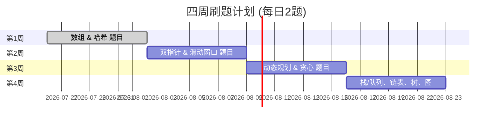
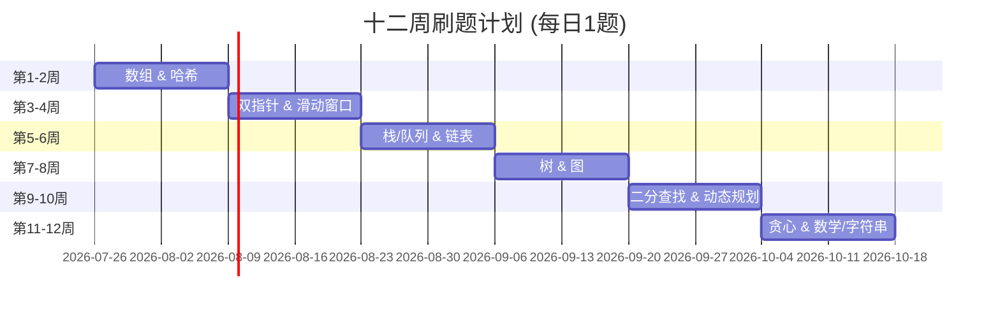

# 执行摘要  
本文制定了两种可行的刷题节奏：① 每天1题方案（12周完成约80题），② 每天2题方案（4周完成约50–60题）。推荐按照专题递进学习：先攻克基础知识点（数组、哈希、双指针、滑动窗口等），再深入树、图、动态规划等。每天定时刷题并留出复盘时间尤为重要：建议将一天分为“做题＋复习”两个阶段，早晚各刷1–2题，中间进行回顾。刷题时先从简单题入手，逐步过渡到中等题再到难题，形成螺旋式上升。刷题成果应同步到 GitHub，并结合标签记录错题，定期按“艾宾浩斯遗忘曲线”复习（例如做题后 12h、1天、2天、7天、15天、1月 等间隔反复练习）。  

## 刷题节奏建议  
- **每日1题方案（慢节奏）**：适合工作日或时间有限的情况。每周5题左右（约12周），保证每题**做精、看懂并总结**，留出时间复盘前期题目。长期坚持，每年可完成350余题。根据经验，不建议仅隔天或三天做1题，而应**每天至少1题**，。刷题顺序：从简单到难，如先易后难，专题化学习。  
- **每日2题方案（快节奏）**：适合备战时间紧张或全职准备。每周10题左右（4–6周完成约50题），要求完成后立即复盘。参考实践，全职刷题者一天通常4–6题；两题方案可在晚上多留出复习归纳时间。每天1题与2题方案都应有固定时间（如早晚各1题），形成习惯，避免临时抱佛脚。  
- **难度进阶**：先攻克简单题，再刷中等难度，最后再刷难题。例如“螺旋上升”策略：每个专题先刷难度≤1700分的题目，再逐渐加入更高难度题。

## 学习进度表（4周 vs 12周）  





- **每周任务示例**：第1周集中攻克数组、哈希等基础题目；第2周练习双指针、滑动窗口；后续周逐步过渡到栈/队列、链表、树、图、动态规划、贪心等专题。每天做完新题后，应留出时间回顾当天及之前的错题。  

## 题目清单（按主题分类）  

题号 | 题名 (中/英) | 难度 | 主题 | 优先级  
---|---|---|---|---  
1 | 两数之和 (Two Sum) | 简单 | 数组/哈希 | 必做  
26 | 删除有序数组中的重复项 (Remove Duplicates) | 简单 | 数组 | 必做  
27 | 移除元素 (Remove Element) | 简单 | 数组 | 推荐  
66 | 加一 (Plus One) | 简单 | 数组 | 推荐  
283 | 移动零 (Move Zeroes) | 简单 | 数组 | 推荐  
217 | 存在重复 (Contains Duplicate) | 简单 | 数组/哈希 | 必做  
35 | 搜索插入位置 (Search Insert Position) | 简单 | 数组 | 推荐  
88 | 合并两个有序数组 (Merge Sorted Array) | 简单 | 数组 | 推荐  
268 | 缺失数字 (Missing Number) | 简单 | 数组/数学 | 推荐  

49 | 字母异位词分组 (Group Anagrams) | 中等 | 哈希/数组 | 推荐  
205 | 同构字符串 (Isomorphic Strings) | 简单 | 哈希/字符串 | 推荐  
242 | 有效的变位词 (Valid Anagram) | 简单 | 哈希 | 推荐  
387 | 字符串中的第一个唯一字符 (First Unique Char) | 简单 | 哈希/字符串 | 推荐  
560 | 和为 K 的子数组 (Subarray Sum K) | 中等 | 哈希/前缀和 | 推荐  
448 | 找到所有数组中消失的数字 (Find Disappeared) | 简单 | 哈希/数组 | 推荐  
202 | 快乐数 (Happy Number) | 简单 | 哈希/数学 | 推荐  

167 | 两数之和 II - 输入有序数组 (Two Sum II) | 简单 | 双指针 | 推荐  
344 | 反转字符串 (Reverse String) | 简单 | 双指针/字符串 | 推荐  
125 | 验证回文串 (Valid Palindrome) | 简单 | 双指针/字符串 | 必做  
680 | 验证回文串 II (Valid Palindrome II) | 简单 | 双指针 | 推荐  
11 | 盛最多水的容器 (Container With Most Water) | 中等 | 双指针 | 推荐  
15 | 三数之和 (3Sum) | 中等 | 双指针 | 必做  
16 | 最接近的三数之和 (3Sum Closest) | 中等 | 双指针 | 推荐  

3 | 无重复字符的最长子串 (Longest Substring Without Repeating) | 中等 | 滑动窗口 | 必做  
76 | 最小覆盖子串 (Minimum Window Substring) | 困难 | 滑动窗口 | 推荐  
209 | 长度最小的子数组 (Min Size Subarray) | 中等 | 滑动窗口 | 推荐  
424 | 替换后的最长重复字符 (Longest Repeating Char Replacement) | 中等 | 滑动窗口 | 可选  
567 | 字符串的排列 (Permutation in String) | 中等 | 滑动窗口 | 推荐  
713 | 乘积小于 K 的子数组 (Subarray Product Less Than K) | 中等 | 滑动窗口 | 推荐  
239 | 滑动窗口最大值 (Sliding Window Maximum) | 困难 | 滑动窗口 | 可选  
438 | 找到字符串中所有字母异位词 (Find All Anagrams) | 中等 | 滑动窗口/哈希 | 推荐  

20 | 有效的括号 (Valid Parentheses) | 简单 | 栈 | 必做  
71 | 简化路径 (Simplify Path) | 中等 | 栈/字符串 | 推荐  
42 | 接雨水 (Trapping Rain Water) | 困难 | 栈/双指针 | 必做  
1047 | 删除字符串中的所有相邻重复项 (Remove Duplicates) | 简单 | 栈/双指针 | 可选  
150 | 逆波兰表达式求值 (Evaluate RPN) | 中等 | 栈 | 可选  
232 | 用栈实现队列 (Queue via Stacks) | 简单 | 栈/队列 | 可选  
394 | 字符串解码 (Decode String) | 中等 | 栈 | 可选  

206 | 反转链表 (Reverse Linked List) | 简单 | 链表 | 必做  
21 | 合并两个有序链表 (Merge Two Lists) | 简单 | 链表 | 必做  
141 | 环形链表 (Linked List Cycle) | 简单 | 链表/双指针 | 推荐  
234 | 回文链表 (Palindrome Linked List) | 简单 | 链表 | 推荐  
19 | 删除链表倒数第 N 个结点 (Remove Nth Node) | 中等 | 链表 | 推荐  
876 | 链表的中间结点 (Middle of Linked List) | 简单 | 链表 | 可选  
160 | 相交链表 (Intersection of Two Lists) | 简单 | 链表 | 可选  

94 | 二叉树的中序遍历 (Inorder) | 简单 | 树/深度优先 | 必做  
102 | 二叉树的层序遍历 (Level Order) | 简单 | 树/广度优先 | 必做  
100 | 相同的树 (Same Tree) | 简单 | 树/深度优先 | 推荐  
101 | 对称二叉树 (Symmetric Tree) | 简单 | 树/深度优先 | 推荐  
144 | 二叉树的前序遍历 (Preorder) | 简单 | 树/深度优先 | 推荐  
104 | 二叉树的最大深度 (Max Depth) | 简单 | 树/深度优先 | 推荐  
226 | 翻转二叉树 (Invert Tree) | 简单 | 树 | 推荐  
98 | 验证二叉搜索树 (Validate BST) | 中等 | 树/深度优先 | 推荐  

200 | 岛屿数量 (Number of Islands) | 中等 | 图/深度优先 | 必做  
207 | 课程表 I (Course Schedule) | 中等 | 图/拓扑排序 | 必做  
133 | 克隆图 (Clone Graph) | 中等 | 图/深度优先 | 推荐  

704 | 二分查找 (Binary Search) | 简单 | 二分查找 | 必做  
35 | 搜索插入位置 (Search Insert) | 简单 | 二分查找 | 推荐  
33 | 搜索旋转排序数组 (Search Rotated) | 中等 | 二分查找 | 推荐  
34 | 在排序数组中查找元素的第一个和最后一个位置 (Find First and Last) | 中等 | 二分查找 | 推荐  
153 | 寻找旋转排序数组中的最小值 (Find Min) | 中等 | 二分查找 | 推荐  

70 | 爬楼梯 (Climbing Stairs) | 简单 | 动态规划 | 必做  
198 | 打家劫舍 (House Robber) | 简单 | 动态规划 | 必做  
53 | 最大子序和 (Maximum Subarray) | 简单 | 动态规划 | 必做  
121 | 买卖股票的最佳时机 I (Best Time I) | 简单 | 贪心/动态 | 推荐  
139 | 单词拆分 (Word Break) | 中等 | 动态规划 | 推荐  
322 | 零钱兑换 (Coin Change) | 中等 | 动态规划 | 推荐  

55 | 跳跃游戏 (Jump Game) | 中等 | 贪心 | 必做  
45 | 跳跃游戏 II (Jump Game II) | 中等 | 贪心 | 推荐  
122 | 买卖股票的最佳时机 II (Best Time II) | 简单 | 贪心 | 推荐  
435 | 无重叠区间 (Non-overlapping Intervals) | 中等 | 贪心/区间调度 | 推荐  
860 | 柠檬水找零 (Lemonade Change) | 简单 | 贪心 | 推荐  
455 | 分发饼干 (Assign Cookies) | 简单 | 贪心 | 可选  

9 | 回文数 (Palindrome Number) | 简单 | 数学 | 必做  
13 | 罗马数字转整数 (Roman to Integer) | 简单 | 数学 | 推荐  
8 | 字符串转换整数 (atoi) | 中等 | 字符串 | 推荐  
290 | 单词模式 (Word Pattern) | 简单 | 哈希/字符串 | 可选  
459 | 重复的子字符串 (Repeated Substring) | 简单 | 字符串 | 可选  
7 | 整数反转 (Reverse Integer) | 简单 | 数学 | 可选  

## 解题思路与常用代码模板  

- **1. 两数之和 (Two Sum, 简单)**：用哈希表记录遍历过的数。遍历数组，对每个数n，判断目标值减去n是否在表中。示例代码（Python）：  
  ```python
  def twoSum(nums, target):
      seen = {}
      for i, n in enumerate(nums):
          if target - n in seen:
              return [seen[target - n], i]
          seen[n] = i
  ```  
  时间复杂度 $O(n)$，空间 $O(n)$。  

- **26. 删除排序数组中的重复项 (Easy)**：双指针法。维护快慢指针 i,j；如果 `nums[i]!=nums[j]`，则将 `nums[j]` 赋给 `nums[i+1]` 并移动 i。  
  ```python
  def removeDuplicates(nums):
      if not nums: return 0
      i = 0
      for j in range(1, len(nums)):
          if nums[j] != nums[i]:
              i += 1
              nums[i] = nums[j]
      return i + 1
  ```  
  时间 $O(n)$，空间 $O(1)$。  

- **27. 移除元素 (Easy)**：同样用双指针，慢指针 `i` 记录结果数组末尾索引，快指针 `j` 遍历数组，跳过等于目标值的元素。  

- **66. 加一 (Easy)**：从末尾逐位加 1，处理进位；若数组首位进位，需在首位插入 1。  

- **283. 移动零 (Easy)**：双指针把所有非零元素向前挤，剩余位置补0。  

- **217. 存在重复 (Easy)**：使用哈希集合判断是否存在相同元素。  

- **35. 搜索插入位置 (Easy)**：二分查找插入点。  

- **88. 合并有序数组 (Easy)**：双指针从后往前合并，避免覆盖。  

- **268. 缺失数字 (Easy)**：异或所有0…n和数组元素，剩余即为缺失数；或求和差值。  

- **49. 字母异位词分组 (Medium)**：对每个字符串排序或计数，然后以其作为哈希键分组。  

- **205. 同构字符串 (Easy)**：用两个哈希表分别记录双向映射关系，确保一一对应。  

- **242. 有效的变位词 (Easy)**：对两个字符串排序后比较，或计数 26 字母出现次数。  

- **387. 字符串中的第一个唯一字符 (Easy)**：先遍历计数，再遍历字符串找出第一个计数为1的字符。  

- **560. 和为K的子数组 (Medium)**：前缀和 + 哈希表。在遍历时记录前缀和出现次数，查找 `prefix[i]-prefix[j]=k` 的情况。  

- **448. 找到所有数组中消失的数字 (Easy)**：遍历数组，将对应下标元素的值置为负数，最后正值下标即为缺失数字。  

- **202. 快乐数 (Easy)**：循环计算各位平方和，用哈希集检测循环；回到1则快乐。  

- **167. 两数之和 II – 有序 (Easy)**：有序数组用双指针夹逼。  

- **344. 反转字符串 (Easy)**：双指针从两端交换字符。  

- **125. 验证回文串 (Easy)**：双指针忽略非字母数字，比较字符。  

- **680. 验证回文串 II (Easy)**：允许跳过一个字符，两次双指针判断。  

- **11. 盛最多水的容器 (Medium)**：双指针从两端向内收缩，计算并取最大面积。  

- **15. 三数之和 (Medium)**：固定一个数，剩下用双指针找两数之和为负值。  

- **16. 最接近的三数之和 (Medium)**：同三数之和，用双指针寻找最接近目标的和。  

- **3. 无重复字符的最长子串 (Medium)**：滑动窗口+哈希表或集合，保持窗口内无重复字符。  

- **76. 最小覆盖子串 (Hard)**：滑动窗口+计数。维护窗口和目标字符串字符频率，移动右指针扩张窗口，左指针收缩。  

- **209. 长度最小的子数组 (Medium)**：滑动窗口，右指针扩张求和≥s时，左指针收缩优化窗口长度。  

- **424. 最长重复字符替换 (Medium)**：滑动窗口 + 记录当前窗口内出现最多字符的频次，窗口大小减去该频次即为需要替换数。  

- **567. 字符串的排列 (Medium)**：滑动窗口固定大小和另一个字符串长度相同，检查字符频率是否相同。  

- **713. 乘积小于K的子数组 (Medium)**：滑动窗口，维护当前窗口乘积，遇到乘积≥K时左指针右移以减小乘积。  

- **239. 滑动窗口最大值 (Hard)**：双端队列存储窗口中的元素索引，保持队首为最大值。  

- **438. 找到字符串中所有字母异位词 (Medium)**：滑动窗口固定长度，使用计数或哈希判断异位词。  

- **20. 有效的括号 (Easy)**：栈。遇左括号压栈，遇右括号则弹栈比较类型是否匹配。  

- **71. 简化路径 (Medium)**：使用栈分割路径，对每个目录名处理“.”、“..”等；最后拼接结果。  

- **42. 接雨水 (Hard)**：双指针或单调栈。常用双指针：左右分别指向，维护两边最大高度，计算当前积水。  

- **1047. 删除字符串中的所有相邻重复项 (Easy)**：栈或双指针。遇相同则出栈。  

- **150. 逆波兰表达式求值 (Medium)**：栈。遇数字入栈，遇运算符弹出2个运算后压入。  

- **232. 用栈实现队列 (Easy)**：两个栈，一边入，一边出。  

- **394. 字符串解码 (Medium)**：栈。数字和字母分别入栈或构造字符串。  

- **206. 反转链表 (Easy)**：迭代或递归。迭代时用两个指针 `prev`、`curr`，逐步反转指向。  

- **21. 合并两个有序链表 (Easy)**：模拟合并过程，使用虚拟头节点依次连接较小节点。  

- **141. 环形链表 (Easy)**：快慢指针，若相遇则有环。  

- **234. 回文链表 (Easy)**：快慢指针找到中点，将后半链表反转，再与前半链表一一比较。  

- **19. 删除链表倒数第N个节点 (Medium)**：快慢指针，快指针先走N步，再同步移动，快到末尾时慢指向待删节点前一位。  

- **876. 链表的中间结点 (Easy)**：快慢指针。  

- **160. 相交链表 (Easy)**：双指针。当一个到头后换到另一个链表头，二者相遇处即交点。  

- **94. 二叉树的中序遍历 (Easy)**：递归或迭代（栈）。  

- **102. 二叉树的层序遍历 (Easy)**：队列广度优先，每次出队并将子节点入队。  

- **100. 相同的树 (Easy)**：递归同时遍历两棵树，节点值、左右结构均相同则相同。  

- **101. 对称二叉树 (Easy)**：递归或迭代。比较左子树与右子树的镜像结构。  

- **144. 二叉树的前序遍历 (Easy)**：递归或迭代（栈）。  

- **104. 二叉树最大深度 (Easy)**：递归取左右子树深度+1。  

- **226. 翻转二叉树 (Easy)**：递归或迭代，交换每个节点的左右子树。  

- **98. 验证二叉搜索树 (Medium)**：递归，维护节点值上下界，或中序遍历判断是否严格递增。  

- **200. 岛屿数量 (Medium)**：DFS/BFS遍历，将访问过的陆地变海水，统计连通块数。  

- **207. 课程表 I (Medium)**：拓扑排序检测有向图是否有环（Kahn算法或DFS）。  

- **133. 克隆图 (Medium)**：DFS/BFS，用哈希映射原节点到新节点，避免重复克隆。  

- **704. 二分查找 (Easy)**：经典二分查找。  

- **35. 搜索插入位置 (Easy)**：标准二分查找返回位置。  

- **33. 搜索旋转排序数组 (Medium)**：修改后的二分查找。判断中点与左端或右端哪个有序，决定下一步。  

- **34. 在排序数组中查找元素的第一个和最后一个位置 (Medium)**：两次二分查找，分别定位左边界和右边界。  

- **153. 寻找旋转排序数组中的最小值 (Medium)**：二分查找，检查中点与右端关系决定折半区间。  

- **70. 爬楼梯 (Easy)**：斐波那契数列，迭代/DP：`dp[i]=dp[i-1]+dp[i-2]`。  

- **198. 打家劫舍 (Easy)**：DP或滚动数组。`dp[i]=max(dp[i-1], dp[i-2]+nums[i])`。  

- **53. 最大子序和 (Easy)**：Kadane算法，维护当前和和最大和：`cur=max(nums[i], cur+nums[i])`。  

- **121. 买卖股票的最佳时机 I (Easy)**：一次遍历记录历史最低价，计算最大利润。  

- **139. 单词拆分 (Medium)**：DP：`dp[i]` 表示前 i 个字符是否可拆分，`dp[i]=dp[j] && s[j:i]在字典`。  

- **322. 零钱兑换 (Medium)**：完全背包问题。`dp[i]=min(dp[i-coin]+1)`。  

- **55. 跳跃游戏 (Medium)**：贪心。记录最远可到达位置，遍历更新。  

- **45. 跳跃游戏 II (Medium)**：贪心或DP。记录当前覆盖区间和下一区间边界。  

- **122. 买卖股票的最佳时机 II (Easy)**：贪心，累加所有正差价。  

- **435. 无重叠区间 (Medium)**：贪心。按右端点排序，选取不重叠区间。  

- **860. 柠檬水找零 (Easy)**：模拟找零，贪心使用大面额。  

- **455. 分发饼干 (Easy)**：贪心。小孩胃口排序，按胃口给最小饼干。  

- **9. 回文数 (Easy)**：直接反转或数字比较，高位低位比较。  

- **13. 罗马数字转整数 (Easy)**：逐字符解析，根据大小关系处理减法情况。  

- **8. 字符串转换整数 (atoi, Medium)**：模拟即可，注意边界和符号。  

- **290. 单词模式 (Easy)**：哈希双向映射模式字符与单词。  

- **459. 重复的子字符串 (Easy)**：字符串匹配技巧，可用 `(s+s)[1:-1].find(s) != -1` 判断。  

- **7. 整数反转 (Easy)**：对十进制数逐位操作，注意溢出。

## GitHub提交规范与复习策略  

- **仓库结构**：按专题归类，如 `LeetCode/Array/1_two_sum.py`，`LeetCode/Hash/49_group_anagrams.py` 等；顶层可有 `README.md` 说明项目结构和学习目标。每题代码文件名可包含题号和英文名，方便索引。示例：  
  ```
  learning-portfolio/
  ├─ LeetCode/
  │   ├─ Array/
  │   │   ├─ 1_two_sum.py
  │   │   ├─ 26_remove_duplicates.py
  │   │   └─ ...
  │   ├─ LinkedList/
  │   ├─ Tree/
  │   └─ ...
  └─ README.md
  ```  
- **每题说明**：每个题目可附 `README.md` 或注释，包含题目描述、核心思路、复杂度分析。例如：  
  ```
  # 1. 两数之和 (Two Sum)
  **思路**：使用哈希表记录已遍历值，检查 target-n 是否存在。  
  **时间复杂度**：O(n)，**空间复杂度**：O(n)。  
  ```  
- **Commit 规范**：每次完成题目后提交，注重描述与题号对应。例如：  
  ```bash
  git commit -m "feat: solve #1 Two Sum using hash map (O(n))"
  ```  
  或 `"完成1号题Two Sum（哈希表解法）"`。清晰标注所解决题目和复杂度，便于检索。  

- **复习策略**：刷题后**务必复盘错题**，形成错题本。为每题打标签（如#哈希、#DP 等），便于分专题回顾。利用艾宾浩斯遗忘曲线“间隔复习”法：对已做题目按 12小时、1天、2天、7天、15天、1月 等间隔重复练习。复习时回顾题目思路，重写代码并理解思考过程，而非死记硬背。每天学习开始前先复习前一天的题目，晚上集中总结全天所学，强化记忆。这样可将知识从短期记忆固化为长期记忆。  

**参考资料：** 灵茶山艾府的专题刷题建议、算法心得和时间管理建议、艾宾浩斯记忆曲线与复习间隔策略等。上述方案结合了刷题顺序、编程练习和记忆规律，帮助系统高效地完成LeetCode练习。